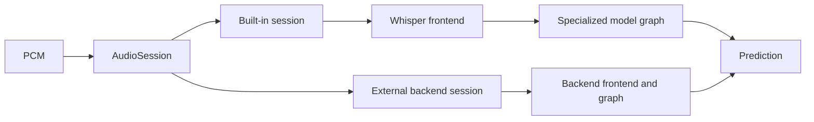

# Runtime architecture

Gophonic separates an extensible audio boundary from specialized model execution.
An application can use `AudioSession` for the two built-in models or another
audio turn-detector architecture. Each backend owns its loader, preprocessing,
operator sequence, and scratch. Built-in converters extract audited weights;
there is no runtime graph interpreter or operator registry.

`AudioSession` exposes PCM prediction and close operations. Concrete built-in
sessions pair a shared immutable model with a private workspace and delegate to
the existing specialized code. Interface dispatch occurs at the prediction
boundary; inner kernels keep concrete types and their current SIMD dispatch.

Full speech-to-text uses the separate `whisper` package. Its `Transcriber`
owns a whole-file mel workspace, encoder scratch, incremental decoder KV
caches, a greedy token policy, and BPE tokenizer. The immutable `whisper.Model`
is shareable across workers; each transcriber and its persistent CPU helpers
belong to one concurrent lane. This text path is separate from `AudioSession`.

The decoder borrows the encoder workspace's persistent worker executor.
Matrix and row operations publish a generation to each helper, use atomic
completion, and write disjoint output ranges. No worker pool is created per
token. `internal/whispergemm` holds Apple SME, Go 1.27 ARM64 SIMD, and scalar kernels;
model loading and first weight packing occur outside warm inference.

An external backend can reuse `WhisperFeatureWorkspace` when its model expects
the same log-mel representation, or supply its own frontend. Its graph does not
need to resemble either built-in model. See the
[backend adapter example](api.md#add-an-audio-backend).

The direct built-in `PredictFeaturesInto` methods start at the log-mel tensor.
WAV and Ogg Opus decoding belong to the CLI; applications pass PCM directly.

## Frontend

`features.go` implements the built-in models' shared frontend;
`WhisperFeatureWorkspace` exposes that frontend independently of model scratch:

1. Average stereo channels, resample when necessary, and right-align an
   eight-second window of 128,000 samples.
2. Normalize the waveform, then apply centered reflection padding and a Hann
   window.
3. Compute the 400-point power STFT with a 160-sample hop. A mixed-radix
   `2×2×2×2×5×5` FFT produces 800 retained frames.
4. Apply the 80-band mel filterbank, logarithm, dynamic-range floor, and output
   normalization to obtain `[80,800]` float32 features.

The transform uses float64 scratch to preserve the frontend's numerical
behavior. TinyMelNet helpers process distinct FFT frame ranges with private
real/imaginary arrays, then distinct mel rows. Per-row accumulation order stays
the same as the serial implementation. A global maximum determines the final
log-mel floor, so the output step waits for all row maxima.

The resampler is a 32-tap windowed-sinc implementation with cached polyphase
coefficients. It is separate from the 16 kHz Whisper oracle coverage; see
[validation limits](validation.md#what-the-tests-do-not-establish).

## Model graphs

Smart Turn uses two convolutions, positional embeddings, four Whisper encoder
layers, attention pooling, and a classifier. Encoder width is 384, with six
attention heads and a 1,536-wide feed-forward layer. Tiled dot products reuse
inputs and weights across multiple output elements. Its nonlinear fast-math
helpers are covered by numerical accuracy tests and model oracle tolerances.

TinyMelNet uses a stride-two convolution stem, three depthwise-separable
convolution blocks, a bidirectional GRU, attention pooling, and a classifier.
The convolution channels are 192; the recurrent sequence has 100 steps and 128
hidden values per direction. Dynamic affine quantization preserves the ONNX
scale, zero-point, saturation, and ties-to-even rounding rules. Integer products
accumulate into `int32`; the graph returns to floating point where specified.
The GRU directions use independent state and run concurrently when helpers are
available. TinyMelNet's GELU uses the standard-library error function.

Weights become immutable after loading. TinyMelNet pre-packs convolution
weights into kernel-friendly layouts during setup. Prediction alternates
between preallocated activation buffers, reuses quantization storage, and
performs layout conversion into dedicated scratch.

## SIMD dispatch

`GOEXPERIMENT=simd` selects tiled FP32 kernels on ARM64 and AMD64. ARM64 also
uses Go 1.27's 128-bit NEON operations through `simd/archsimd` for TinyMelNet
quantization, dense and depthwise integer convolutions, mel-layout conversion,
and selected GRU projection tiles. TinyMelNet's integer stages use scalar Go
fallbacks on AMD64; other architectures use scalar Go kernels throughout.

These are Go compiler intrinsics expressed in Go source. SIMD support is
experimental in Go 1.27, so changing the toolchain requires rebuilding and
checking the numerical and performance gates. The development performance
numbers are for ARM64; they do not establish AMD64 speed.
[Go 1.27 SIMD documentation](https://go.dev/doc/go1.27).

## Concurrency and ownership

For built-in sessions, the model is shared read-only and one session owns one
workspace. A caller may also manage the workspace directly. Each helper
has a fixed identity and a private completion signal. TinyMelNet helpers also
have private FFT scratch.
A dispatched stage has one job descriptor that stays unchanged until all
helpers finish. Output ranges do not overlap; the caller participates in the
same partitioned work.

Persistent helpers use channels to wait for work and report completion. Idle
workers block. The caller waits at data dependencies before republishing the
job or reusing a buffer. This is a blocking channel protocol, with no library
global work queue or shared atomic completion counter.

TinyMelNet fuses work when the same lane can consume its own output immediately:
convolution plus GELU, and a mel row plus its logarithm. This removes whole
dispatch/completion rounds while retaining each lane's output range. Reduction
and tensor dependencies still have explicit barriers.

The design minimizes shared mutable ownership rather than duplicating the
model or every tensor for each helper. Read-only inputs and disjoint output
ranges remain in common backing arrays. Numerical reduction order is preserved
where it affects quantization or recurrence.

## Source map

| Concern | Main files |
| --- | --- |
| PCM session interface and built-in adapters | `session.go` |
| Standalone Whisper frontend API | `whisper_features.go` |
| PCM, resampling, FFT, mel | `features.go` |
| Smart Turn weights and graph | `model.go`, `inference.go` |
| Smart Turn scratch and workers | `workspace.go`, `parallel.go` |
| TinyMelNet weights and graph | `tinymel_model.go`, `tinymel_inference.go` |
| TinyMelNet scratch and workers | `tinymel_workspace.go` |
| Quantization and layouts | `tinymel_quant*`, `tinymel_mel_quant*`, `tinymel_conv_pack.go` |
| SIMD kernels and dispatch | `*_simd.go`, `*_dispatch_*.go` |
| Recurrent math | `tinymel_gru*` |
| Offline conversion | `tools/onnx_to_gophonic.py`, `tools/tinymel_to_gophonic.py` |
| File decoding and JSON CLI | `cmd/gophonic/` |
| Whisper bundles, audio, encoder, decoder, tokenizer, transcription | `whisper/` |
| Whisper SME, NEON, and scalar GEMM/GEMV kernels, worker executor | `internal/whispergemm/` |
| Whisper checkpoint and oracle tools | `tools/whisper_pt_to_gophonic.py`, `tools/whisper_oracle.py` |

`internal/int8probe` is an isolated Smart Turn GEMM experiment. It is not called
by the production inference graph.
