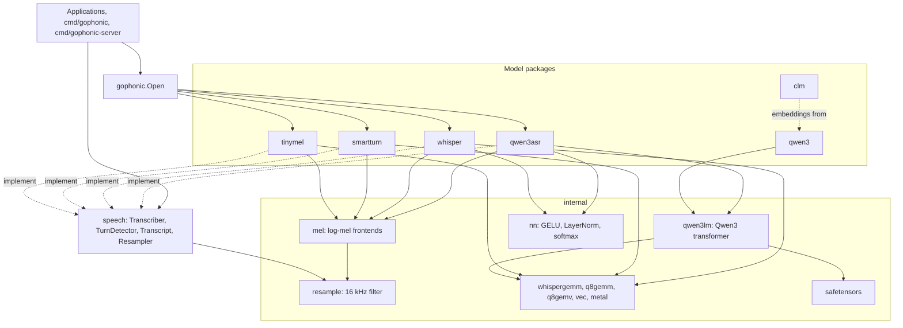
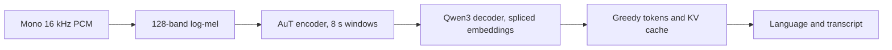
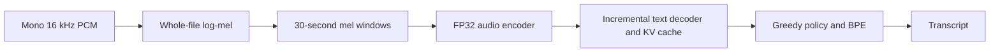
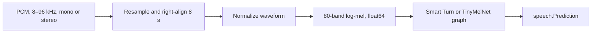

# Architecture

gophonic has three layers. Applications program against model-independent
interfaces; each model family lives in its own package; the numerical work
those packages share lives in internal packages. There is no runtime graph
interpreter or operator registry: each model is a specialized Go
implementation of one audited architecture.

## Dependency rules

- **`speech` is a leaf.** It holds the interfaces, result types, the language
  table, and the resampler, and imports no model code, so any package,
  including a third-party backend, can implement its interfaces.
- **Model packages never import each other.** Whatever two models share (a
  frontend, a filter, a kernel, a transformer core) lives in `internal`.
- **The root package only dispatches.** `gophonic.Open` asks each
  registered `Format` whether it matches the path and lets the first one load
  it; the built-in formats are one table in `formats.go`, and `Register` adds
  third-party ones. A loaded `Model` provides lanes of the interface types
  its format declares, `speech`'s or any other, so a new capability needs no
  change to gophonic. The package also hosts the turn detectors' standalone frontend,
  which external backends reuse.
- **Numerical work is shared, not duplicated.** One FFT, one mel-bank
  builder, and one resampling filter serve every model; one Qwen3 core serves
  every Qwen3 model.

## Transcription

`qwen3asr.Transcriber` owns a whole-clip mel frontend, the audio encoder's
activations and workers, a Qwen3 decoder workspace, a key/value prefix that
grows to the longest prompt seen, and the prompt, token, and text buffers.
The encoder runs its matrix products on `internal/whispergemm` and its
LayerNorm, GELU, and softmax on `internal/nn`; the decoder is the shared
Qwen3 core. The audio embeddings replace the prompt's placeholder rows, and
greedy decoding reads the head's logits after each token.

[Qwen3-ASR](qwen3asr.md) covers the model, its decoder formats, and the
measurements.

`whisper.Transcriber` owns a whole-file mel workspace, encoder scratch,
incremental decoder key/value caches, a greedy token policy, and the BPE
tokenizer. The immutable `whisper.Model` is shared by any number of
transcribers; each transcriber and its persistent CPU helpers belong to one
lane. `Transcribe` adapts it to `speech.Transcriber`.

The decoder borrows the encoder workspace's persistent worker executor.
Matrix and row operations publish a generation to each helper, use atomic
completion, and write disjoint output ranges; no worker pool is created per
token. `internal/whispergemm` holds the Apple SME, Go 1.27 SIMD, and scalar
kernels. Model loading and first weight packing happen outside warm
inference. [Whisper design](whisper-design.md) covers the graph and kernels.

## Turn detection

Smart Turn uses two convolutions, positional embeddings, four Whisper encoder
layers, attention pooling, and a classifier. Encoder width is 384, with six
attention heads and a 1,536-wide feed-forward layer. Tiled dot products reuse
inputs and weights across multiple output elements. Its nonlinear fast-math
helpers are covered by numerical accuracy tests and model oracle tolerances.

TinyMelNet uses a stride-two convolution stem, three depthwise-separable
convolution blocks, a bidirectional GRU, attention pooling, and a classifier.
The convolution channels are 192; the recurrent sequence has 100 steps and 128
hidden values per direction. Dynamic affine quantization preserves the ONNX
scale, zero-point, saturation, and ties-to-even rounding rules. Integer
products accumulate into `int32`; the graph returns to floating point where
specified. The GRU directions run concurrently when helpers are available.

Weights are immutable after loading. TinyMelNet pre-packs convolution weights
into kernel-friendly layouts during setup; prediction alternates between
preallocated activation buffers and reuses quantization storage.

## Frontends

`internal/mel` implements every log-mel frontend on one 400-point
mixed-radix (`2×2×2×2×5×5`) FFT, written once for float32 and float64, and
one Slaney mel-bank builder for any number of bands. All frontends use a
periodic Hann window, centered reflection padding, a 160-sample hop, the
power spectrum, and a dropped final STFT frame, then Whisper's 1e-10 log
floor, max-minus-8 dynamic floor, and `(log10(mel)+4)/4` scaling.

| Frontend | Precision | Used by | Input and output |
| --- | --- | --- | --- |
| `mel.Turn` | float64 | Smart Turn, TinyMelNet, `ExtractWhisperFeaturesInto` | Last 8 s at 8–96 kHz, normalized, `[80,800]` |
| `mel.Window` | float32 | Whisper windows | First 30 s at 16 kHz, `[bands,3000]` |
| `mel.Spectrogram` | float32 | Whisper whole-file, Qwen3-ASR | Any length plus configurable silence, `[bands,frames]` |

`mel.Turn` exposes its stages (`Normalize`, `PowerFrames`, `MelRows`,
`LogMelRows`, `Finish`) so TinyMelNet's helpers can split FFT frames and mel
rows across goroutines with private FFT scratch; each value is computed by the
same operations as the serial pass, so the output does not depend on the
helper count. `mel.Window` shards across a `whispergemm.Executor` and, on SME
machines, computes the STFT and mel projection as matrix products: the frame
matrix is the padded signal read with a 160-sample row stride.

`internal/resample` builds the 32-tap Hann-windowed sinc polyphase filter that
brings PCM to 16 kHz. `speech.Resampler` applies it to whole recordings;
`mel.Turn` applies it only to the eight-second window it keeps.

## Qwen3

`internal/qwen3lm` is the Qwen3 dense transformer: the safetensors loader
(including a decoder nested in a larger checkpoint, with its head) and weight
formats (exact FP16, rotated int8, GPU int8 per row or in blocks of 32, and
4-bit, with optional GPTQ rounding), the byte-level BPE tokenizer from
`tokenizer.json` or `vocab.json` and `merges.txt`, with allocation-free
decoding, and a batched forward pass with stored key/value prefixes, spliced
input embeddings, and logits on SME tiles, portable kernels, or the GPU
through `internal/metal`. The GPU kernels are specialized by the model's
widths when the model loads. `qwen3` builds its text tasks on it
(embeddings, zero-shot questions, growing contexts, the exact embedding
cache) and re-exports the low-level types; `qwen3asr` runs its decoder. Its random-checkpoint oracle, `internal/qwen3lm/lmtest`,
writes small Qwen3 checkpoints and evaluates them with a float64 forward
pass for the tests of every package on the core. The
[qwen3 README](../qwen3/README.md) and the
[performance report](clm-performance.md) describe the kernels and results.

## SIMD dispatch

`GOEXPERIMENT=simd` selects tiled FP32 kernels on ARM64 and AMD64 through Go
1.27's `simd/archsimd` intrinsics: the shared dot products in `internal/vec`,
TinyMelNet's quantization, dense and depthwise integer convolutions,
mel-layout conversion, and GRU projection tiles, and Qwen3's elementwise
stages. TinyMelNet's integer stages use scalar Go on AMD64; other
architectures use scalar Go throughout. SME kernels are Go assembly selected
at run time when the CPU reports SME.

SIMD support is experimental in Go 1.27, so changing the toolchain requires
rebuilding and checking the numerical and performance gates. The development
performance numbers are for ARM64; they do not establish AMD64 speed.
[Go 1.27 SIMD documentation](https://go.dev/doc/go1.27).

## Concurrency and ownership

A model is shared read-only; a lane or workspace owns its scratch and
helpers. Each helper has a fixed identity and a private completion signal. A
dispatched stage has one job descriptor that stays unchanged until all
helpers finish, output ranges do not overlap, and the caller works on its own
share of the same partition.

TinyMelNet fuses work when a lane can consume its own output immediately
(convolution plus GELU, a mel row plus its logarithm), removing whole
dispatch rounds while keeping each lane's output range. Reductions keep
explicit barriers, and numerical reduction order is preserved where it
affects quantization or recurrence.

## Source map

| Concern | Location |
| --- | --- |
| Model-independent interfaces, transcripts, languages, resampler | `speech/` |
| Format detection and lanes; standalone turn frontend | `gophonic.go`, `features.go` |
| Log-mel frontends, FFT, mel banks | `internal/mel/` |
| 16 kHz polyphase filter | `internal/resample/` |
| Qwen3-ASR loader, audio encoder, prompt, decoding, output rules | `qwen3asr/` |
| Whisper bundles, encoder, decoder, tokenizer, transcription | `whisper/` |
| Smart Turn weights, graph, scratch, workers | `smartturn/` |
| TinyMelNet weights, graph, quantization, GRU, workers | `tinymel/` |
| Qwen3 text tasks and cache | `qwen3/` |
| Qwen3 transformer, loader, tokenizer, GPU, GPTQ | `internal/qwen3lm/` |
| Safetensors reader | `internal/safetensors/` |
| CLM ranking heads | `clm/` |
| SME, NEON, and scalar kernels | `internal/whispergemm/`, `internal/q8gemm/`, `internal/q8gemv/`, `internal/vec/` |
| Encoder row kernels: exact GELU, LayerNorm, softmax exponential | `internal/nn/` |
| Pure-Go Metal binding | `internal/metal/` |
| WAV and Ogg Opus decoding, transcript formats, HTTP server | `internal/audiofile/`, `internal/transcriptformat/`, `internal/httpserver/` |
| CLI, server, GPTQ tool | `cmd/` |
| Offline converters and oracle tools | `tools/`, `qwen3/tools/`, `qwen3asr/tools/` |

`internal/int8probe` is an isolated Smart Turn GEMM experiment that the
production graph does not call.
