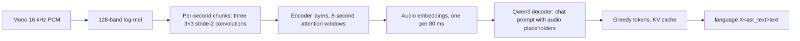

# Qwen3-ASR

[`qwen3asr`](../qwen3asr) runs Qwen3-ASR, the open speech recognizer from
Alibaba's Qwen team: 30 languages and 22 Chinese dialects, language
detection, and context biasing, from the official
[Qwen/Qwen3-ASR-1.7B](https://huggingface.co/Qwen/Qwen3-ASR-1.7B) and
[Qwen/Qwen3-ASR-0.6B](https://huggingface.co/Qwen/Qwen3-ASR-0.6B) snapshot
directories. There is no conversion step: the loader reads `config.json`,
the safetensors shards, and the slow-tokenizer files as published.

```go
model, err := qwen3asr.Load("models/Qwen3-ASR-1.7B", qwen3asr.Options{})
lane, err := qwen3asr.NewTranscriber(model, 0) // or gophonic.Open(...).NewTranscriber()
err = lane.Transcribe(ctx, pcm16k, speech.Options{Language: "zh", Context: "交易所"}, &transcript)
```

## Pipeline



- **Frontend.** `internal/mel.Spectrogram` with 128 Slaney bands and no
  padding: Hugging Face's `WhisperFeatureExtractor` as the processor calls it.
- **Encoder (AuT).** The features split into 100-frame chunks; every chunk,
  including a shorter last one, is zero-padded to the longest before the
  convolutions, as the reference pads them, and only the outputs of real
  frames continue. Activations are time-major with channels innermost, so
  each convolution is one SME matrix product over im2col rows whose three
  frequency taps are contiguous, and the last one's rows feed `conv_out`
  unchanged. Sinusoidal positions restart per chunk. The pre-LayerNorm
  layers attend bidirectionally within windows of `n_window_infer` frames
  (104 outputs), and `ln_post`, `proj1`, GELU, and `proj2` produce one
  embedding per output frame. On the CPU the products run on SME tiles
  (`internal/q8gemm`) with every BF16 weight exact as scaled FP16 and each
  activation row rounded to FP16 after scaling into FP16's full range; bias,
  GELU, and the query scale are applied to each finished block. The row
  kernels come from `internal/nn`. On the GPU (`encoder.metal`) the same
  exact weights meet FP16 activation tiles in 64×64 products with FP32
  accumulation, prefetched K steps, and split K for products too small to
  fill the GPU; the convolutions read their im2col rows in place.
- **Decoder.** The shared Qwen3 core, `internal/qwen3lm`, loaded from the
  `thinker.model.` tensors with the `thinker.lm_head` head. The audio
  embeddings replace the `<|audio_pad|>` rows of the prompt
  (`HiddenLastExtendEmbedInto`); every prompt position has equal
  multimodal-RoPE coordinates, which makes MRoPE plain RoPE. Decoding is
  greedy with a key/value cache that keeps the audio-independent prompt
  prefix across calls.
- **Output.** The reference's `parse_asr_output`: the runaway-repetition
  fix, the language before `<asr_text>`, "language None" for audio without
  speech, and a forced language that makes the model write the text alone.
  Audio longer than 20 minutes is cut at the quietest 100 ms window within
  5 s of each limit, as the reference's `split_audio_into_chunks` does.

## Decoder formats

| `Options.Format` | Weights | Activations | Where |
| --- | --- | --- | --- |
| `FormatGPU` (`"gpu-q8"`, the default with a Metal GPU) | int8 in blocks of 32 with an FP16 scale, Hadamard-rotated inputs | FP32 | Apple GPU |
| `FormatF16` (`"f16"`, the default elsewhere) | every BF16 weight exactly, as scaled FP16 | FP16 per row | CPU, SME |

The format also places the encoder: `FormatGPU` runs it on the GPU,
`FormatF16` on the CPU; both keep its weights exact.

`gpu-q8` is new to `internal/qwen3lm`. Qwen3-1.7B rows do not quantize well
with a single scale per row: the per-row `gpu` format keeps the decoder's
final hidden state at cosine 0.9963 of the exact path, below llama.cpp's
Q8_0 rounding of the same weights. Blocks of 32 values, as GGML's Q8_0 does,
on top of the randomized Hadamard rotation, raise it to 0.9984–0.9986, above
Q8_0's 0.9972–0.9987, for 6% more weight bytes. With block scales the online
Hadamard of the down projection's input no longer pays for its dispatch, so
`gpu-q8` drops it. The head is stored the same way and computed on the GPU.

The GPU kernels in `internal/qwen3lm/gpu.metal` are specialized by the
model's geometry at load time, so one source serves Qwen3-8B, Qwen3-1.7B,
and Qwen3-0.6B. Single-token attention reads the cache in blocks of eight
keys, with four simdgroups sharing each head's keys, so its loads and
reductions overlap.

## Measurements

Apple M4 Max, warm lane, PCM to text, Qwen3-ASR-1.7B, zero allocations
(`go test -bench Transcribe ./qwen3asr`):

| Clip | `gpu-q8` | `f16` |
| --- | ---: | ---: |
| 11.0 s English (JFK) | **226 ms** | 751 ms |
| 4.2 s Chinese | **85 ms** | 284 ms |

For the JFK clip on the GPU, 226 ms is 19 ms for the encoder, 49 ms to
prefill the 158-token prompt, and 30 tokens at about 5 ms each, the head's
logits included. On the CPU the encoder takes 68 ms: its FP16 products keep
both SME units busy, and the tile kernel takes four K pairs per iteration
with multi-vector loads, 752 GMAC/s on one core.

| Encoder, JFK clip | Time | Matrix throughput |
| --- | ---: | ---: |
| GPU | **19 ms** | 4.6–9.8 TFLOPS per product |
| CPU, SME | 68 ms | ≈2.5 TFLOPS on the two SME units |

The decoder alone, against llama.cpp build `ece963f41` on the same geometry
(`llama-bench -m Qwen3-1.7B-Q8_0.gguf -p 158 -n 64 -fa 1`):

| | gophonic `gpu-q8` | llama.cpp Metal Q8_0 |
| --- | ---: | ---: |
| One token | **4.67 ms** | 5.54 ms |
| 158-token prompt | 49 ms | **40.7 ms** |

One token streams 1.5 GB of layer weights and 0.33 GB of head weights; at
the measured 440 GB/s that is 4.15 ms, so decoding runs within 12% of the
memory bandwidth floor.

## Validation

[`tools/reference.py`](../qwen3asr/tools/reference.py) runs the official
`qwen-asr` package in FP32 on the test clips and records features, encoder
rows at every window edge, prompt ids, the 32 largest first-step logits, and
the greedy continuation (`testdata/qwen3asr`). The tests require:

- features within 1e-4, encoder rows at cosine ≥ 0.999999 and within 2e-4
  on both encoders (measured: 0.9999998 and 6e-5), and the processor's prompt
  ids exactly;
- the exact generated ids and transcripts for `f16`, and the same
  transcripts and first token for `gpu-q8`, whose logits stay within 1.5;
- no allocations in warm `Transcribe` calls, in both formats;
- the reference's parsing, repetition fix, token counts, positions, and
  audio cuts, against values computed with the reference functions.

One difference from the reference implementation is deliberate. The encoder
passes its attention windows as `cu_seqlens`, which vLLM and flash attention
honor but the Transformers eager and SDPA paths ignore: on the CPU,
`qwen-asr` attends across the whole clip. gophonic follows the windowed
computation, the one vLLM runs and the Qwen team evaluated with, and
`tools/reference.py` supplies the windows as a mask so the fixtures do too.
